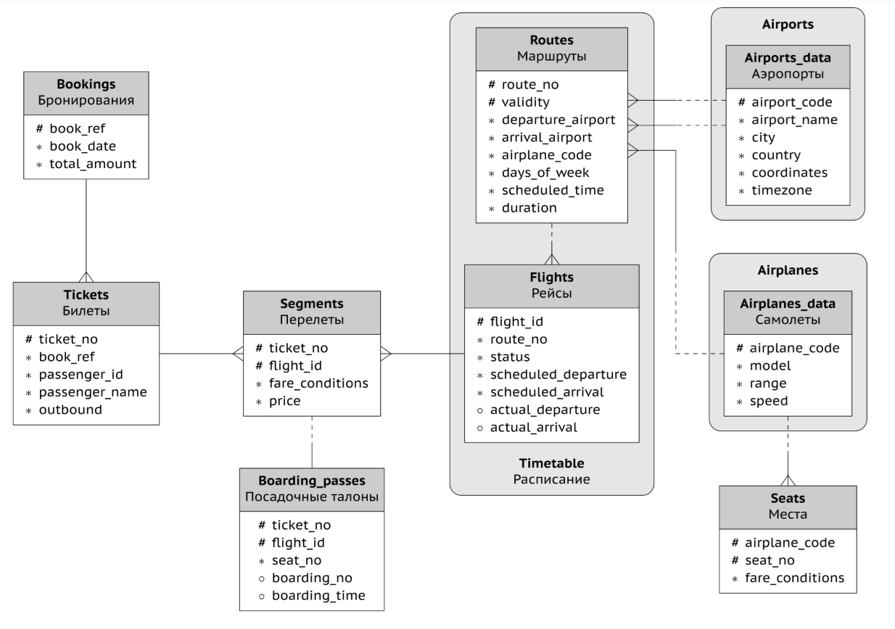

# Задача
Научиться предсказывать количество купленных билетов и их классы обслуживание за какое-то время до вылета. Немного
изучив данные я пришел к выводу, что в среднем люди покупают билеты за `37.45` дней до рейса. 
В таком случае поставим задачу как `Какое количество билетов будет приобретено за 1 месяц (30 дней) до рейса с учетом 
класса обслуживания`, в таком случае можно будет использовать как статические данные, например время рейса, маршрут, 
вместимость самолета и тд, так и динамические данные $-$ количество уже приобретенных билетов

## Цель проекта
Развить навыки разведочного анализа данных (Exploratory Data Analysis $-$ EDA), обучения модели и работы с современными 
библиотеками для Data Science и Machine Learning  
Научиться работать с популярными библиотеками для ML $-$ pyspark, mlflow

### ETL & EDA
Начал работу с поиска таргета. Нашел его в таблице `segments`, агрегировал по `flight_id` и получил, что у меня на 1 
рейс приходится количество билетов эконом класса, комфорта и бизнеса.

Для поиска предположительных признаков я нашел в таблицах данные, связанные с `flight_id`, после агрегировал по этому 
аттрибуту. Из `flights` я взял время вылета по расписанию, из `routes` город и страну отправления и прибытия, время 
полета, массив дней, в которые осуществляются полеты рейса, из таблицы `airplanes` и `seats` 
взял модели самолета, его дальность полета, скорость и количество мест каждого класса обслуживания. Данные признаки 
будут статическими, так как никак не изменяются. Так же я взял количество приобретенных билетов за 30 дней до полета из
таблицы `bookings`  
После исследования не числовых признаков и постороенния матрицы корреляций для числовых я отобрал следующие признаки:
`'target_economy', 'target_comfort', 'target_business', 'departure_day', 'departure_day_of_week', 'departure_month',
'is_weekend', 'departure_hour', 'duration_hours', 'count_of_week_routes', 'airplane_range', 'economy', 'comfort',
'business', 'avg_book_lead_time', 's2_book_lead_time', 'count_book_lead_time', 'is_avg_book_lead_time_missing',
'departure_city', 'departure_country', 'arrival_city','arrival_country', 'airplane_model'`

### Modeling & Training
Для оценки моделей использую WAPE и RMSE
#### Baseline
Использовал обычную линейную регрессию, заменил не числовые значения с использованием StringIndexer, датасет 
разделил на train и test по времени, 158 дней (27048 рейсов) пошли в train и 53 дня (9504 рейсов) в test.   
RMSE = 54.2271  
WAPE = 20.7532%  
#### 